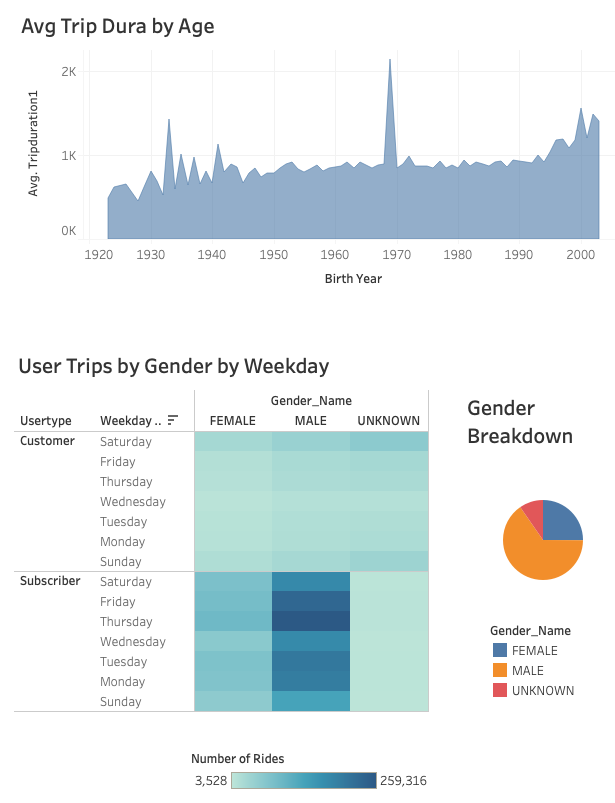
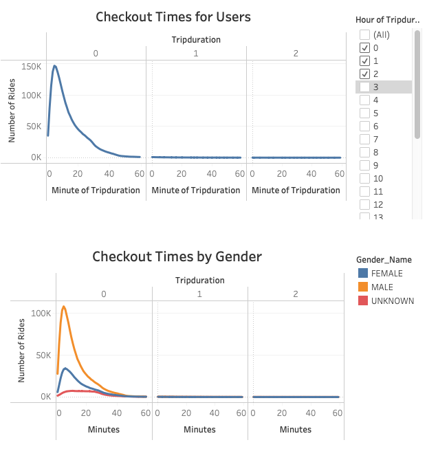
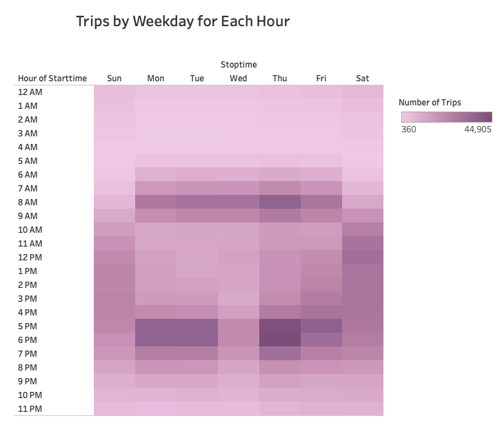
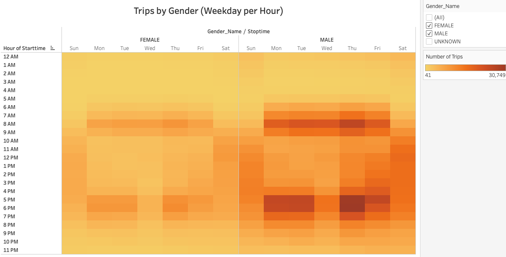
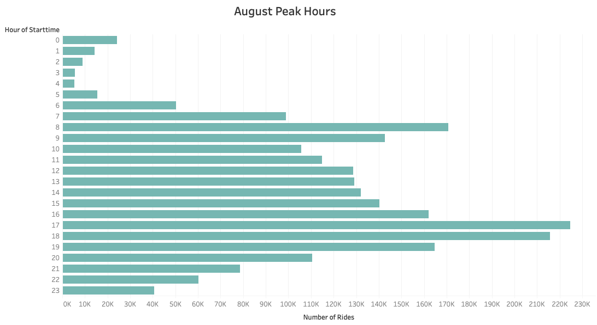

# bikesharing

## Overview of the analysis:
Amazed by the Citibike in New York City, which allows tourists to bike everywhere to get to know the city and interact with the people who live there using bikes for the daily commute, we want to start a similar sharing business for our hometown of Des Moines, Iowa. We want to study the Citibike program in New York City to figure out how it works there and carefully choose the mechanisms to apply to Des Moines. We will use data analysis and visualization to impress the potential investor for seed funding.

## Results: 

In this program, we used Tableau Public to analyze the Citibike data in New York in August 2019. The data visualization below will tell us who are using city bikes during the day, the week they tend to use them, and the peak hours of usage in August.

### Who is using Citibike

- The age of users has a negative correlation with average trip duration. That means the younger the users are, the longer time they are likely to use the sharing bikes. 
- More than half of them are male users, while female users take up about 25% of the total users. 
- There are more subscribers than customers. That means there are more regular users than "try-it-once" users.

### Trip Duration

- Bikes are mostly checked out for short rides. Most bikes are used and returned within an hour, and 20 minutes is what over 50% of riders would use.

### When do they tend to use sharing bikes.

- On weekdays, most trips happen during rush hour. People use bikes to commute in the morning from 7 AM to 10 AM and cycle back home from 5 PM to 8 PM.
- For weekends, people are more likely to use sharing bikes for fun during the day, but the usage during weekends is lower than on weekdays.
- Females and males have similar habits, but men use Citibike more than women.

### An Overview of the Whole Month

- Summer is a busy season for biking. The best bike maintenance window would be from 2 AM to 5 AM.
- Peak hours happen in the mornings and evenings during daily commute hours. But overall, August is an excellent time to start the business. It is also vital to manage the supply and demand in the summertime.

## Summary:
This study shows that a city like New York, especially its busy downtown area, is the best place for sharing business. Sharing bikes is in high demand in rush hours by commuting workers for short trips.

Other data analysis and visualization proposals:
- Similar analysis throughout the whole year to find the trend.
- Compare the bike service locations and trip start/end locations to see if the areas with high demand are efficiently covered.

### Link to Dashboard on Tableau Public:
[link to dashboard](https://public.tableau.com/app/profile/bibo.wang/viz/CitiBike_Challenge_Dashboard2/Dashboard2)

